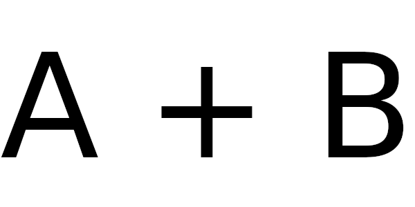

# A+B

Your task is to [add](https://en.wikipedia.org/wiki/Addition) 2 numbers and print the result.

## Input format

You are given a and b (-10^18 < a, b < 10^18) on a single line
separated by a space. The numbers may be floating point with very high precision.

## Output format

One number which is the resul
t of a+b

